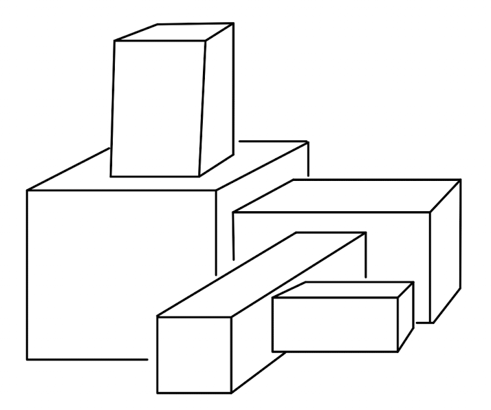

### Description

This project expands on the ludobots course found on Reddit. In this project, I have created a robot "snake" that generates a kinematic chain (a jointed, motorized, innervated, sensorized snake) and fills a 3D space. The snake will have a random amount of links with random sizes, and random sensor placements along the chain (links colored green have sensors and links colored blue do not have sensors). Additionally, in order to make the snake more 3D, the links will be jointed in random directions, rather than down a 1D line.

Example of an object that can be created.

### Running The Code

In order to run the code, download all of the files along with any libraries from import statements, then simply run the command 'python3 main.py' and watch the snake be created.