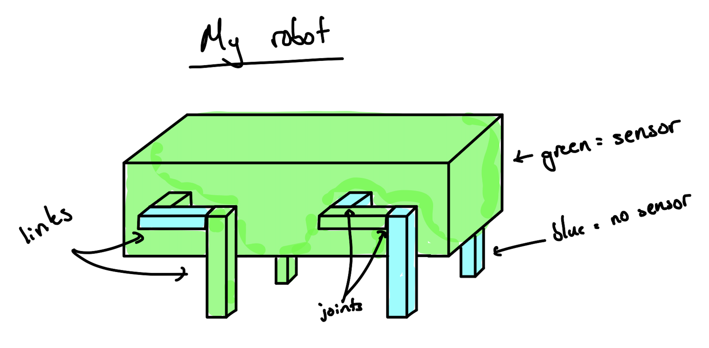
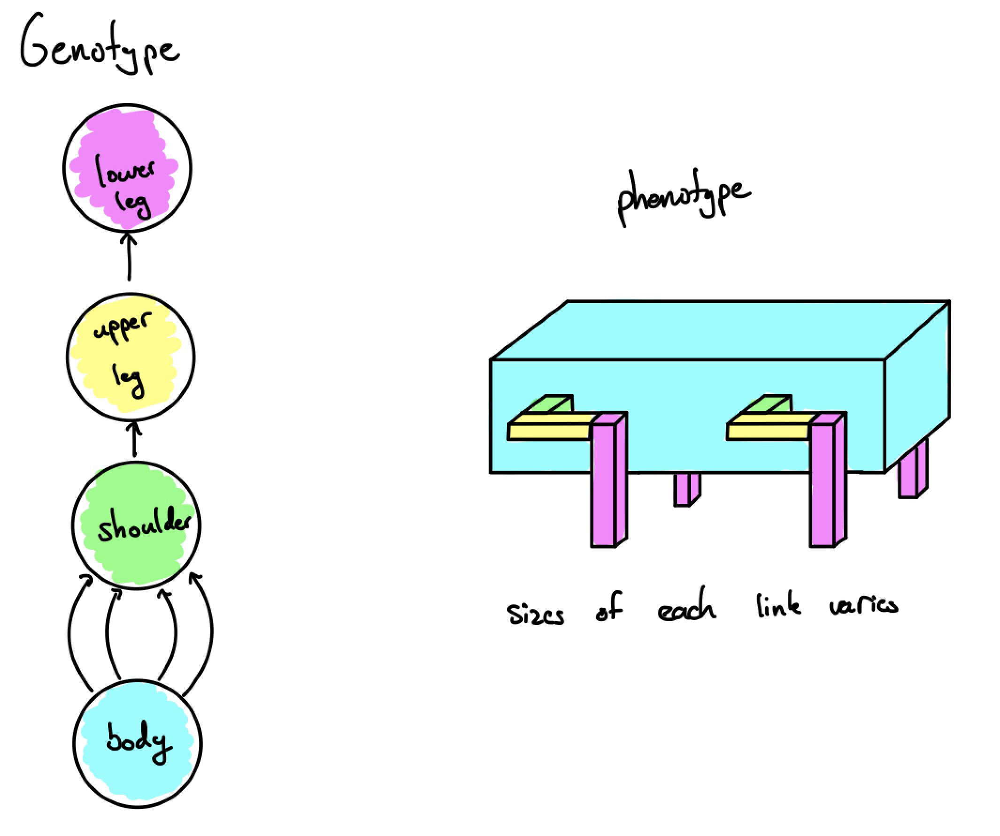
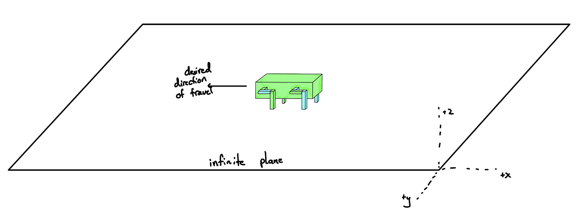
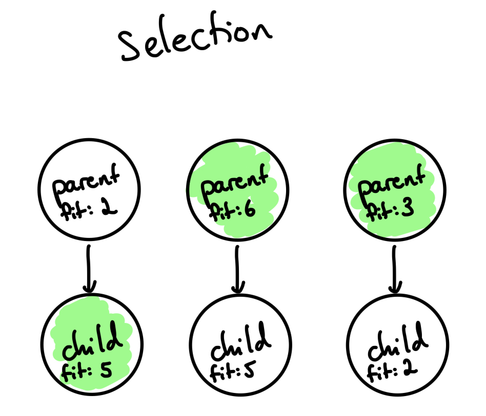
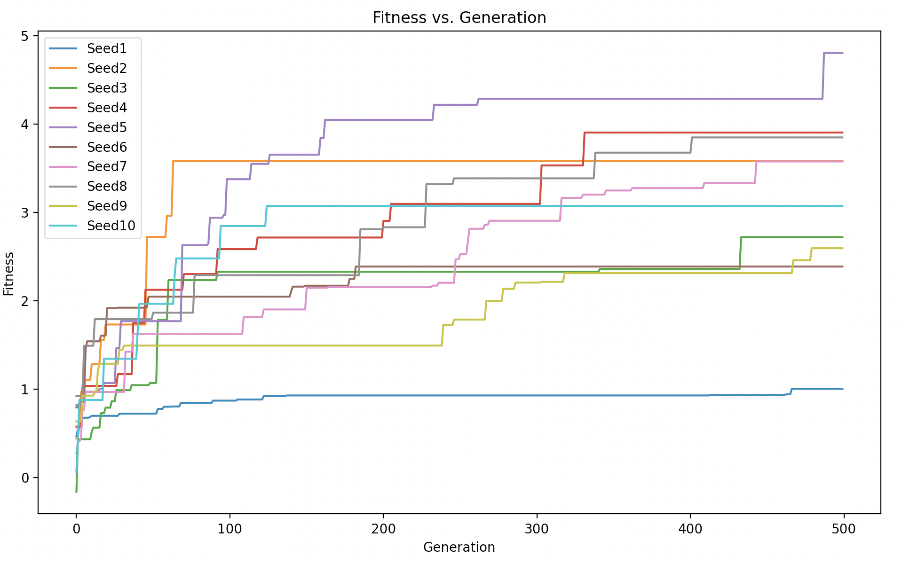

# Description

This project expands on the ludobots course found on Reddit (https://www.reddit.com/r/ludobots/wiki/installation/). The course makes use of pyrosim (Python Robot Simulation) in order to create the simulations. For this project, I have made use of links, joints, motors, and sensors to created a somewhat random design in a 3D space. More specifically, I have created a robot "dog" that generates a kinematic chain (a jointed, motorized, innervated, sensorized snake). The dog is allowed to evolve its brain and a little bit of its morphology to work towards the goal of moving as far in the -x direction as possible during the simulation. In order to evolve the body, a random link/cube is selected each generation and the size of one its dimensions is slightly modified by adding/subtracting a small value to itself. Along with this, the brain is modified by changing the weights of its synaptic connections - similiary to the previous change, a random weight is changed every generation to a number between -1 and 1.

# Installation

Clone the following repository:

```
git clone -b assignment8 https://github.com/joshbutera/mybots.git
```

# Requirements

- Python3

- numpy

- Matplotlib

- pyrosim

- pybullet

# Running The Code

Navigate to the simulation folder and run the following:

```
python3 main.py
```

Depending on your computer, different adjustments may need to be made to allow the code to run smoother. You can change the amount of generations or the population size in the constants.py file. Along with this, you can also adjust how many loops are performed in the main.py file by changing the value in the range of the loop itself.

After this program has finished running, run:

```
python3 show_graph.py
```
in order to visualize the progression of the robots over the generations.

# Evolution

The robot itself is created by connecting four legs to a body in which the legs consist of a shoulder, upper leg, and lower leg. Each of these links are made at a certain size plus or minus a small random value. Joints connect each of the limbs to allow them to move together along with randomly selected limbs having a sensor. From here, the goal is for the robot to come up with the best design to travel as far as possible in the -x direction, either by changing the sizes of its links, or changing the weights of different sensor values.

# Diagrams

The above diagram helps to explain hwo the robot is created. As shown by the phenotype, a four shoulders are extended from the body with an upper leg extending from the shoulder, and lastly a lower leg connected to the upper leg. This then results in the genotype as shown on the right side. Each of the links created by the phenotype are created with specific sizes plus or minus a small random value.


The above figure demonstrates how the robot looks in its world where there is an infinite plane that the robot is placed onto. The robot then does any evolutions necessary in order to travel the furthest in the -x direction.


In order to evolve, the robot makes use of multiple generations where in each generation, the parent is compared to the child. The child is created by copying the "blueprint" of the parent and modifying one of the sensor weights along with the size of a limb. The fitnesses of each respective parent and child are compared only between the two, picking the "better" robot and allowing only that robot to proceed to the next generation. Again, these comparisons are only between the parent and child, not agains the entire population. Again, these evolutions always resulted in changing the size of a limb or weight of a sensor, but most times I noticed that smaller limbs helped to improve the fitness.


# Visuals



In testing the code, I used a population size of 10 and 500 generations with different random seeds set by numpy.random.seed() ranging from 1-10 meaning a total of 50,000 simulations were ran. Each of the different tests saw the score/fitness increase over the generations, resulting in robot dogs that were better performing at the task of essentially walking or crawling in some cases. The results are seen in the graph above. Many of the changes resulted in smaller limbs and most the changes involved changing the weights of the sensors in order for the robot to have a better gait. As seen in the graphs, there was often times were not many mutations were beneficial, and the evolution essentially got stuck. A lot of the robots lacked proper gaits that you might see in an actual dog which made it very difficult to actually perform tasks such as walking.

# Videos

- Teaser Video: https://youtu.be/hCLrryzC1SY
- 2 Minute Video: https://youtu.be/ydviVg9Bj38
