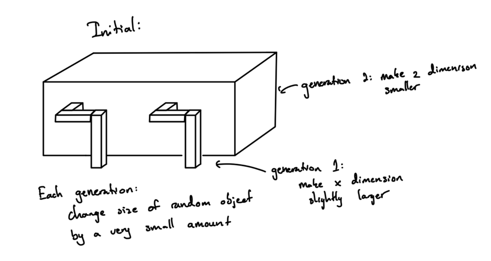

### Description

This project expands on the ludobots course found on Reddit (https://www.reddit.com/r/ludobots/wiki/installation/). In this project, I have created a robot "dog" that generates a kinematic chain (a jointed, motorized, innervated, sensorized snake) and fills a 3D space. The dog is allowed to evolve its brain and a little bit of its morphology to work towards the goal of moving as far in the -x direction as possible during the simulation. In order to evolve the body, a random link/cube is selected each generation and the size of one its dimensions is slightly modified by adding/subtracting a small value to itself. Along with this, the brain is modified by changing the weights of its synaptic connections - similiary to the previous change, a random weight is changed every generation to a number between -1 and 1.

Example of an object that can be created.

### Testing

In testing the code, I used a population size of 25 and 100 generations (each of these can be changed in the constants.py file) with different random seeds set by numpy.random.seed(). All of these different seeds started off with the same initial robot but were allowed to evolve in different ways depending on the random values that were given. Each of the different tests saw the score/fitness increase over the generations, resulting in robot dogs that were better performing at the task of essentially walking or crawling in some cases.

### Running The Code

In order to run the code, download all of the files along with any libraries from import statements, then simply run the command 'python3 main.py' and watch the snake be created.